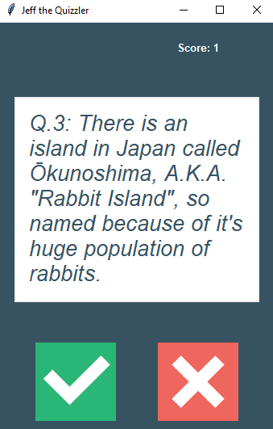

# Geography Quiz Game

This is a simple quiz game focused on geography-related questions. It asks the player a series of questions and provides feedback on their answers.

## Getting Started

### Prerequisites

- Python 3 installed on your system
- tkinter library (usually included in Python standard library)
- requests lib (in order to get the API)

### How to Run

1. Clone the repository to your local machine:
   ```sh
    git clone https://github.com/fingledingle/jeff-the-quizzler
   
2. Navigate to the project directory: 
    ```sh
   cd jeff-the-quizzler
   
3. Run the game: 
    ```sh
   python main.py

### How to Play

- The game starts by presenting the player with a series of geography-related questions.
- For each question, the player must input click the buttons: Red for false, Green for True.

### Screenshot

<p align="center">
  
</p>


### Files


- `question_model.py`: Defines the `Question` class.
- `data.py`: Grabs list of questions from the Trivia API
- `quiz_brain.py`: Implements the `QuizBrain` class for managing the game.
- `main.py`: Orchestrates the game by creating question objects and initiating the quiz.
- `UI.py`: Ui for the game


### Acknowledgments
- API By opentdb
